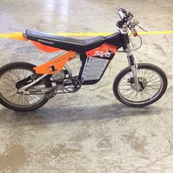
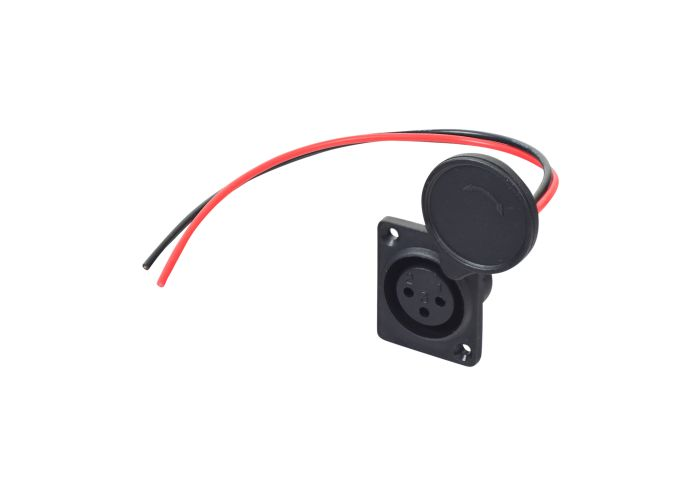
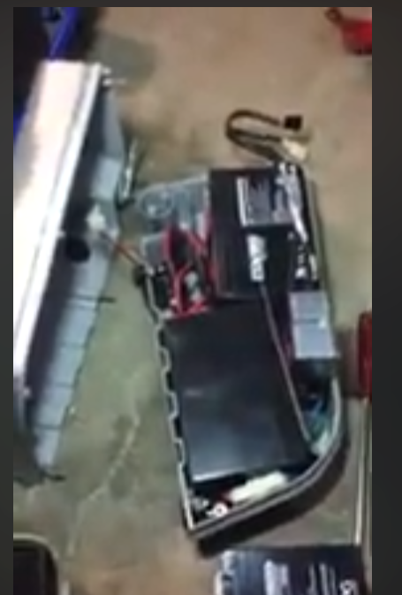
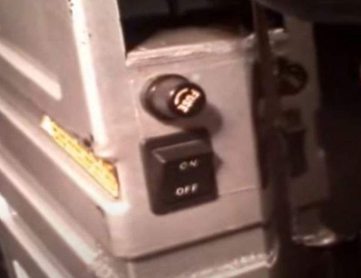

# Investigación sobre la Bicicleta Eléctrica Mongoose Dirt Bike CX24V450

Estoy tratando de investigar sobre la bicicleta eléctrica Mongoose Dirt Bike CX24V450.

## Modelo

**Mongoose Dirt Bike CX24V450**

## Tipo de Motor

La bicicleta está equipada con un motor **Currie**.

## Remodelaciones

Encontré un par de remodelaciones en la bicicleta. Puedes verlas en los siguientes enlaces:

- [Endless Sphere Forum - Mongoose CX24V450 with 2500-Watt L-R Small Block](https://endless-sphere.com/sphere/threads/mongoose-cx24v450-with-2500-watt-l-r-small-block.92544/)
- [Video en YouTube - Mongoose CX24V450 Electric Dirt Bike Upgrade](https://www.youtube.com/watch?v=eIediyNsjhM)

## Artículo sobre Partes de la Bicicleta

Aquí hay información sobre las partes de la bicicleta:

- [Electric Scooter Parts - Mongoose CX24V450 Electric Dirt Bike Parts](https://www.electricscooterparts.com/mongoose-cx24v450-electric-dirt-bike-parts.html)
- [Monster Scooter Parts - Mongoose CX24V450 Parts](https://www.monsterscooterparts.com/trsc/rec-brands/mongoose/cx24v450)

## Puerto de 3 Puntos - XLR Connector

El puerto de 3 puntos utilizado en esta bicicleta se llama **XLR Connector**:

## Cargador

Para poder cargar la bicicleta eléctrica Mongoose CX24V450, se necesita un cargador con puerto XLR. Aquí hay más información al respecto:

- [Monster Scooter Parts - Mongoose CX24V450 Charger](https://www.monsterscooterparts.com/trsc/rec-brands/mongoose/cx24v450/moelscbach1.html)
- [Video en YouTube - Electric Bike Chargers Explained - 7 Things you should know](https://www.youtube.com/watch?v=j2fwqOfJ2mI)

## Testing del Controlador

Aquí hay algunos videos sobre cómo revisar controladores de bicicleta eléctrica:

- [Video en YouTube - Testing Controller for Blown Mosfets](https://www.youtube.com/watch?v=G6rTRT3qPR8)

## Observaciones

En el minuto 2:05 de este video aparece la orientación de las baterías en la bicicleta:

- [Video en YouTube - Observación de Baterías](https://www.youtube.com/watch?v=3T3ITuJ_NfA)

Hay un "conector" extra que no pude saber para qué era en el minuto 1:39 de este video:

- [Video en YouTube - Conector No Identificado](https://www.youtube.com/watch?v=XklP6CuWb9I)

